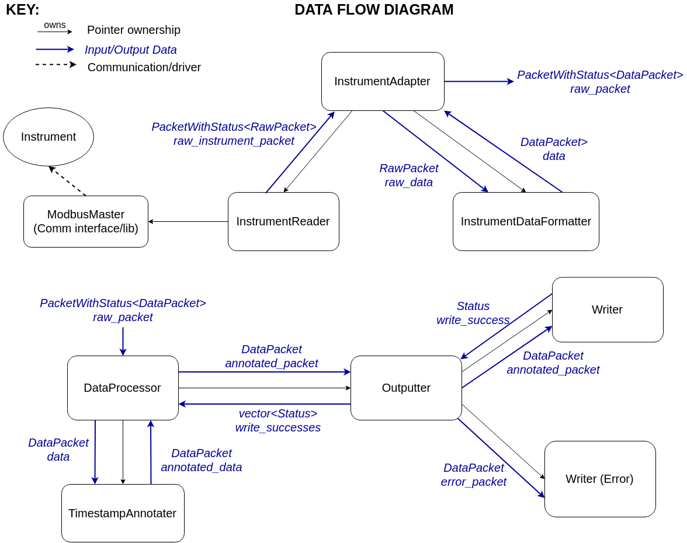

# TIK-boron
#### (really needs a new name. TIK = Teledyne Instrument Kit, nifty, but very constraining in the instrument vendors we want to reach :))
This repository contains firmware that creates a general architecture for:
- connecting a reference instrument to a Particle device
- adding metadata such as time or geo-location to a data packet
- publishing the data to the cloud
- writing the data to an SD card
- logging errors to the cloud and SD card

# Contents:
- [The Architecture](#the-architecture)
  - [The InstrumentAdapter](#the-instrumentadapter)
  - [The DataProcessor](#the-dataprocessor)
- [Adding Instrument](#adding-instrument)
  - [Adding Instrument Using Modbus](#adding-instrument-using-modbus)
  - [Adding Other Instrument](#adding-other-instrument)
- [Adding Writer](#adding-writer)
  - [Adding Writer to Main Program](#adding-writer-to-main-program)
  - [Adding Custom Writer](#adding-custom-writer)
- [Tests](#tests)
  - [Running Unit Tests](#running-unit-tests)
  - [Running Local Build](#running-local-build)
  

# The Architecture


## The InstrumentAdapter
The InstrumentAdapter has a Reader and DataFormatter. The Reader will return a RawPacket of data received directly from an instrument, along with a Status. If the Status is OK, the InstrumentAdapter calls the DataFormatter to convert the RawPacket into the common DataPacket type (which all members of DataProcessor use). A DataPacket's data field is a comma-separated string.

If the Reader returns with an error, the InstrumentAdapter converts the error into a DataPacket, writing the error msg as the data field, propagating the Status and error msg for the DataProcessor to handle.

## The DataProcessor
The DataProcessor will receive a raw data packet and annotate it. If the original packet only contained an error (non-OK status), it will output it as an error packet. If the original packet has an OK status, it will output it as a normal packet.

The Outputter has two functions. Output(DataPacket) will send a data packet to all added writers. Usually, these writers will batch data packets and actually write them less frequently then they receive packets. The outputter then returns a list of Statuses, whether each writer successfully wrote the packet, and if not, what error it returned.

If the outputter returns non-OK statuses, the DataProcessor will follow up by sending out error packets. OutputError(DataPacket) will send a data packet (where the data is an error msg) to all added error writers. These writers can be configured to have a batch number of 1 so they will write the packet as soon as they receive it. No status is returned, since if writing an error fails, there is nowhere else that can take care of it.

# Adding Instrument
The current firmware was being tested on a Teledyne T400 instrument which uses Modbus RTC over RS232 (Serial).

## Adding Instrument Using Modbus
To configure the firmware to work with a Modbus instrument:
1. Update T400_register.h (TODO: rename this file) with the appropriate input registers and discrete input registers. Don't forget to add your fields to the SD_FILE_HEADER_STR field.
2. Adjust the read rate in TIK_V0.ino (TODO: move to a separate config header file).
3. Adjust the baud_rate for ModbusMaster in TIK_V0.ino. _Note: The max baud rate for ModbusMaster on Argon is 57600. 115200 results in an invalid Modbus transaction._

## Adding Other Instrument
To configure the firmware to work with a different protocol:
1. Modify the RawPacket class by adding the fields that you need.
2. Extend the InstrumentReaderInterface class. Your class must contain a Read() function that returns a PacketWithStatus with a RawPacket.
3. Extend the InstrumentDataFormatterInterface class. Your class must contain a Format() function that transforms a RawPacket into a DataPacket.
4. Update the _reader_ and _data_formatter_ unique_ptr in the main .ino file to initialize as members of your new classes.

# Adding Writer
Writers are data output methods. The current firmware has a Serial Writer which simply prints the packet or error to the serial monitor and a CloudWriter which hasn't been tested on a device, but was mocked and unittested (please update if necessary). There is also a sketch for an SD Writer without an implementation.

## Adding Writer to Main Program
To add a writer to the program:
1. In the main .ino file, initialize a unique_ptr to the desired reader.
2. You may need to pass an Options struct to the Writer. For example, for a Cloud Writer, set the batch number to 5 so it sends the data 5 packets at a time. For an Error Writer, set the batch number to 1 so it writes the data as soon as it receives it.
3. In setup(), call `outputter.AddWriter(std::move(your_writer_unique_ptr));`
4. If you want to configure the writer as an error writer, call `outputter.AddErrorWriter(std::move(your_writer_unique_ptr));`

## Adding Custom Writer
To add a custom writer:
1. Extend the WriterInterface class. It should contain a AddDataPacket class.
2. Add the writer to the main program (steps above).

# Tests
Tests are built using the Catch2 unittest framework and the Fakeit mocking framework.

## Running Unit Tests
From the test/ folder, run the command:
```
$ make TEST=true && ./build/allTests
```

## Running Local Build
The test/run/ folder contains an example sketch modified to compile locally (there are a few Particle defined functions I wasn't able to mock).
From the test/ folder, run the command:
```
$ make && ./build/main
```
Be careful leaving <iostream> and std::cout calls from the local build in files which particle compiles.
You will get a very long error that looks like this:
```
/usr/local/gcc-arm-embedded/bin/../lib/gcc/arm-none-eabi/4.9.3/../../../../arm-none-eabi/lib/armv7-m/libg_nano.a(lib_a-readr.o): In function `_read_r':
readr.c:(.text._read_r+0x10): undefined reference to `_read'
collect2: error: ld returned 1 exit status
../../../build/module.mk:222: recipe for target 'target/workspace.elf' failed
make[1]: Leaving directory '/firmware/modules/photon/user-part'
make[1]: *** [target/workspace.elf] Error 1
../build/recurse.mk:11: recipe for target 'modules/photon/user-part' failed
make: *** [modules/photon/user-part] Error 2
```
See (rickkas7's answer)[https://community.particle.io/t/solved-problems-using-libraries-implemented-in-cpp/40038/4] for more information.
